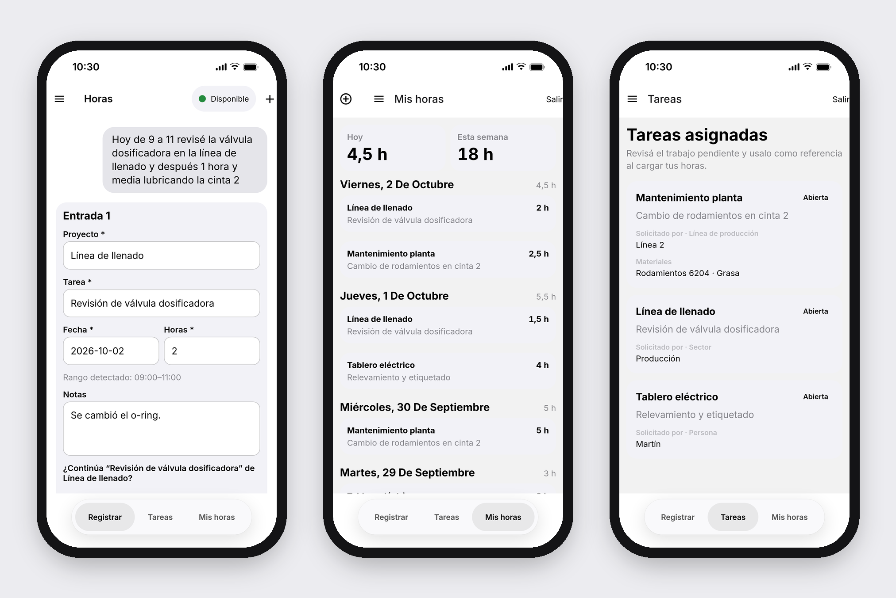
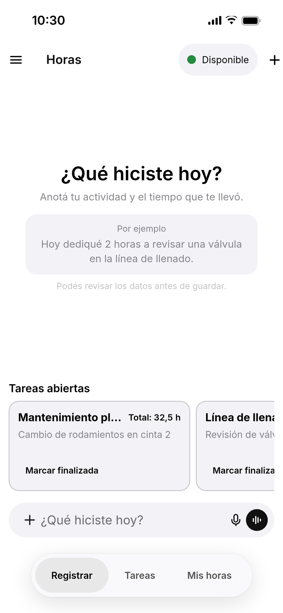
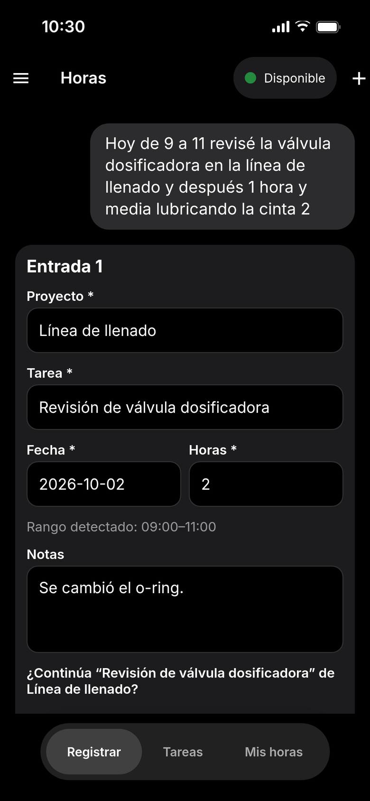
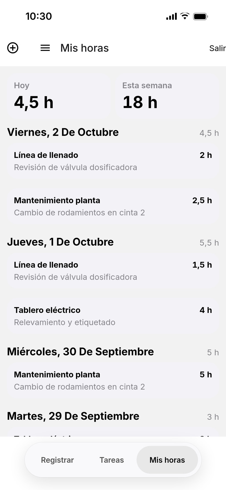
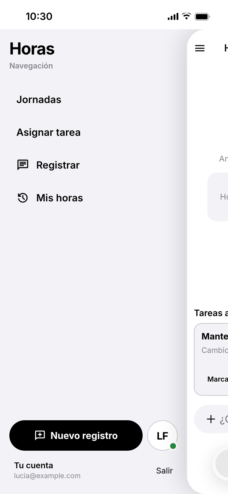
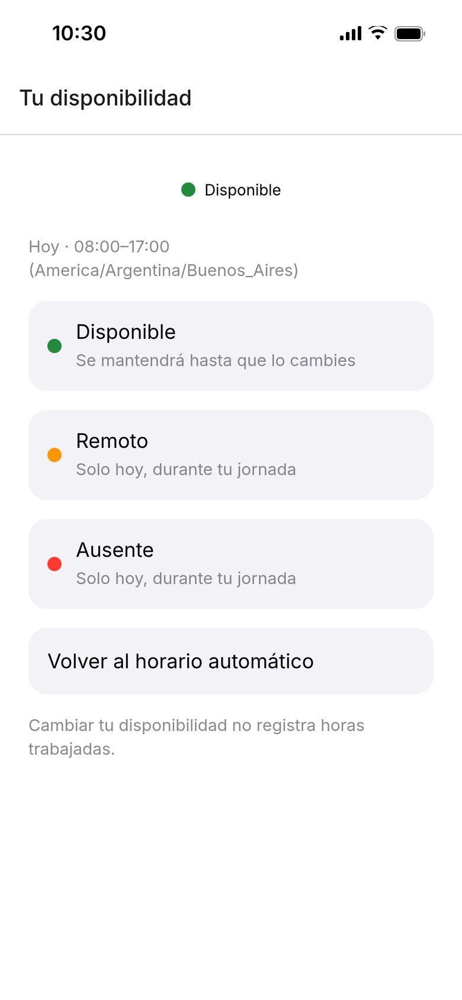
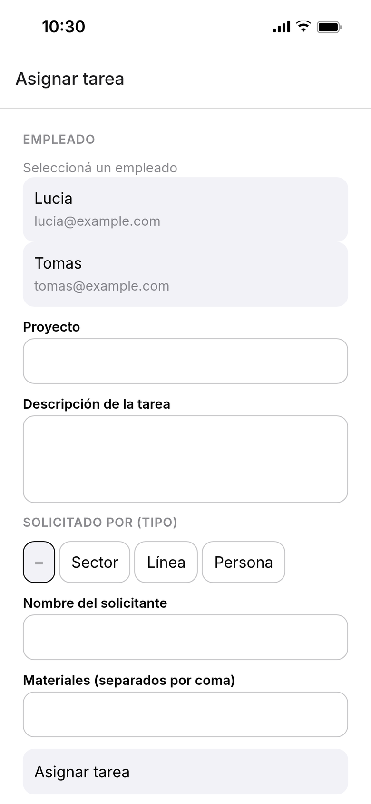

# Horas

**Log your work hours by chatting. Gemini turns a quick message into reviewable time entries.**

<p align="center">
  <picture>
    <source media="(prefers-color-scheme: dark)" srcset="docs/screenshots/hero-dark.png">
    
  </picture>
</p>

Horas is an iOS-first mobile app (Expo + React Native) for employees who need to report
what they worked on without filling in a timesheet. You write or dictate something like
*"Hoy de 9 a 11 revisé la válvula dosificadora en la línea de llenado y después 1 hora y
media lubricando la cinta 2"*. A Supabase Edge Function asks Gemini for structured drafts,
validates them, and returns editable cards. **Nothing goes into the database until you
confirm the drafts.**

> The UI is in Spanish (es-AR). Originally built for an industrial client; this public
> version is rebranded and uses sample data.

---

## Features

- **Chat capture**: describe your day in plain Spanish. One message can produce several
  entries (one per project/activity), with dates, durations, time ranges and notes.
- **Voice dictation**: hold the mic in the composer for live on-device speech recognition
  (`expo-speech-recognition`), with a recording waveform and timer.
- **Photo evidence**: attach photos from the library. They upload to a private Storage
  bucket and are linked to the work stream.
- **Draft review**: every draft is an editable card (project, task, date, hours, notes).
  Project names are matched against your recent projects to avoid near-duplicates, and
  you can continue an open task instead of creating a new one.
- **Clarifying questions**: if the project, task or duration is missing, the assistant asks
  one short follow-up question and keeps the context of earlier answers.
- **Manual entry**: a native form sheet for adding an entry without the chat.
- **Weekly history**: today and this week totals, entries grouped by day, swipe to edit.
- **Assigned tasks**: open work streams with requester details and materials, plus a
  "mark as finished" action.
- **Availability**: a status badge in the header (Disponible / Remoto / Ausente / Fuera de
  horario), computed from the employee's schedule and time zone, with manual overrides.
- **Admin tools**: admins configure weekly schedules for each employee and assign tasks.
  The assignee gets an Expo push notification.
- Native feel: Expo Router native tabs, liquid-glass surfaces on iOS 26, swipe-to-open
  navigation menu, reduced-motion aware animations, light and dark mode.

<p align="center">
  
  
  
</p>
<p align="center">
  
  
  
</p>

## How the AI pipeline works

```
App (chat turns, JWT) ──► Edge Function `extract-time-entries` (Deno)
                              │ 1. authenticate the user from the JWT
                              │ 2. validate the body with Zod (≤ 20 KB, ≤ 8 turns, ≤ 2,000 chars each)
                              │ 3. consume_ai_quota() in Postgres (50/user/day, 500/day global)
                              │ 4. load up to 20 recent work streams for project matching
                              │ 5. call Gemini with a JSON response schema
                              │ 6. validate the model output with Zod + business rules
                              ▼
                        drafts or one clarifying question ──► App (editable cards)
                                                                  │ user confirms
                                                                  ▼
                                               confirm_time_entries() RPC ──► Postgres
```

- **Model**: `gemini-3.5-flash-lite` via the Generative Language API
  (`supabase/functions/_shared/gemini.ts`). The API key is only a server-side secret
  (`GEMINI_API_KEY`). The app bundle never has it.
- **Structured output**: the request sets `responseMimeType: application/json` and a
  `responseJsonSchema` (`extractionJsonSchema`). The response is either
  `{ status: "ready", drafts: [...] }` or `{ status: "needs_clarification", question,
  missingFields }`.
- **Validation**: the output is parsed again with Zod (`modelResponseSchema`). Durations
  must be 1–1,440 minutes, times must be `HH:mm`, and IDs must be UUIDs. A clarification
  must not contain drafts, and a ready response must have at least one draft.
  `suggestedWorkStreamId` is only accepted if it is one of the user's recent streams.
- **24-hour rules**: no future dates and no ranges that cross midnight. If the existing
  minutes for a day plus the proposed ones exceed 24 h, the function asks a clarifying
  question instead of returning drafts. The same limit is enforced again by a Postgres
  trigger on insert/update.
- **Only confirmed entries are stored**: chat turns stay on the device and are sent
  statelessly. Only the drafts the employee confirms are written, through an RPC.
- A live check (`bun run test:gemini:live`) runs a small Spanish corpus against the real
  model to catch regressions in duration parsing.

## Security

- **Row Level Security on every table** (`profiles`, `work_streams`, `time_entries`,
  `work_evidence`, schedules, availability overrides, push tokens, AI usage counters).
  Employees can only read and write their own rows.
- **Security-definer RPCs** in private schemas (`private`, `availability_private`,
  `assignment_private`) with `search_path = ''` for privileged work: confirming entries,
  admin schedule management, task assignment and push token registration. Admin checks
  run on the server against `profiles.role`.
- **Idempotent confirm**: `confirm_time_entries(p_submission_id, p_drafts)` takes a
  per-submission advisory lock and has a unique `(user_id, submission_id, client_id)`
  constraint, so a retried request never creates duplicate entries.
- **AI cost ceiling in Postgres**: `consume_ai_quota()` enforces 50 extractions per user
  per day and 500 globally, atomically, before any Gemini call.
- **Push delivery on the server**: task-assignment pushes go through `pg_net` inside the
  RPC, so the admin's device never sees another user's push token
  (see [ADR 0001](docs/decisions/0001-task-assignment.md)).
- The auth session is stored in `expo-secure-store`. Sign-in uses a magic link or a 6-digit
  email code through Supabase Auth.

## Tech stack

| Layer | Technology |
| --- | --- |
| App | Expo SDK 57, React Native 0.86, React 19.2, Expo Router 57 (native tabs, typed routes), React Compiler |
| UI | Reanimated 4.5, Gesture Handler 2.32, Keyboard Controller, expo-glass-effect, expo-symbols, FlashList 2 |
| State and validation | Zustand 5, Zod 4 |
| Device | expo-speech-recognition, expo-media-library, expo-notifications, expo-secure-store, expo-haptics |
| Backend | Supabase (Postgres 17, Auth, Storage, Edge Functions on Deno 2), supabase-js 2.112, pg_net |
| AI | Google Gemini (`gemini-3.5-flash-lite`), JSON schema output |
| Tooling | TypeScript 6, Bun, ESLint 9, Jest 29 + jest-expo + Testing Library, pgTAP, Maestro, EAS Build |

## Project structure

```
src/
  app/                 Expo Router routes: (auth) onboarding/sign-in, (app) tabs and sheets
  screens/             capture (chat), history, tasks, edit entry
  components/          chat composer and attachments, draft cards, UI primitives
  features/            availability, assignment, manual entry, notifications, profile, swipe menu
  data/                Supabase client, auth service, repositories
  domain/              pure logic: time normalization, week summary, availability
  state/               Zustand stores for capture and history
supabase/
  functions/           extract-time-entries Edge Function + shared extraction core
  migrations/          schema, RLS policies, RPCs, quotas, storage bucket
  tests/               pgTAP tests
tests/                 Jest unit/component tests and Maestro E2E flows (tests/e2e)
scripts/               live Gemini corpus check
docs/decisions/        architecture decision records
```

## Tests

| Suite | Command | What it covers |
| --- | --- | --- |
| Jest (297 tests, 49 suites) | `bun run test` | domain logic, stores, repositories, the extraction core and Gemini adapter (mocked), components, navigation |
| pgTAP (5 files, 77 assertions) | `supabase test db` | RLS isolation, ownership, confirmation idempotency and quotas, availability, task assignment |
| Maestro | `maestro test tests/e2e` | onboarding, sign-in keyboard handling, availability flows on a device/simulator |
| Live Gemini | `GEMINI_API_KEY=... bun run test:gemini:live` | real-model check of Spanish duration parsing |
| Types | `bun run typecheck` | `tsc --noEmit` |

## Getting started

### Prerequisites

- Bun and Node.js 22
- Xcode (iOS simulator or device) and/or Android Studio
- [Supabase CLI](https://supabase.com/docs/guides/local-development/cli/getting-started) and
  a Supabase project
- A Gemini API key from Google AI Studio
- EAS CLI (optional, for cloud builds)

### 1. Install

```bash
bun install
```

### 2. Set up Supabase

```bash
supabase login
supabase link --project-ref <project-ref>
supabase db push                                   # applies migrations (RLS, RPCs, storage, pg_net)
supabase secrets set GEMINI_API_KEY=<your-gemini-key>
supabase functions deploy extract-time-entries
```

In **Authentication → URL Configuration**, add `horas://auth/callback` as a redirect URL.
To give a user admin rights (schedules and task assignment):

```sql
update public.profiles set role = 'admin' where email = 'you@example.com';
```

### 3. Configure the app

```bash
cp .env.example .env
```

```dotenv
EXPO_PUBLIC_SUPABASE_URL=https://<project-ref>.supabase.co
EXPO_PUBLIC_SUPABASE_PUBLISHABLE_KEY=<supabase-anon-or-publishable-key>
```

Only public values go in `.env`. Never use the `EXPO_PUBLIC_` prefix for the Gemini key or
the service-role key.

### 4. Run

The app uses native modules (speech recognition, glass effects, secure store), so it needs
a development build. Expo Go is not supported.

```bash
bun run ios            # expo run:ios (local dev build)
# or, with EAS:
bun run eas:init       # sets your own EAS projectId/owner
bun run build:dev:ios
bun run start:dev
```

### Local database (optional)

```bash
supabase start
supabase db reset      # migrations + empty seed
supabase test db       # pgTAP
```

## License

[MIT](LICENSE) © 2026 Kevin Anrique. Third-party code notices are in
[THIRD_PARTY_NOTICES.md](THIRD_PARTY_NOTICES.md).
